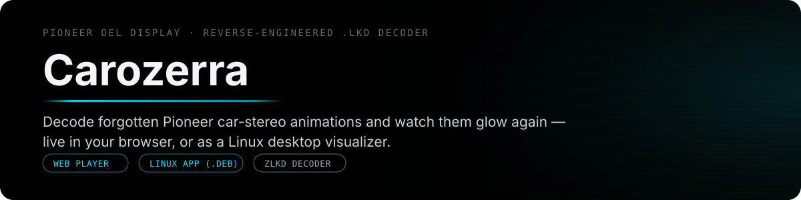
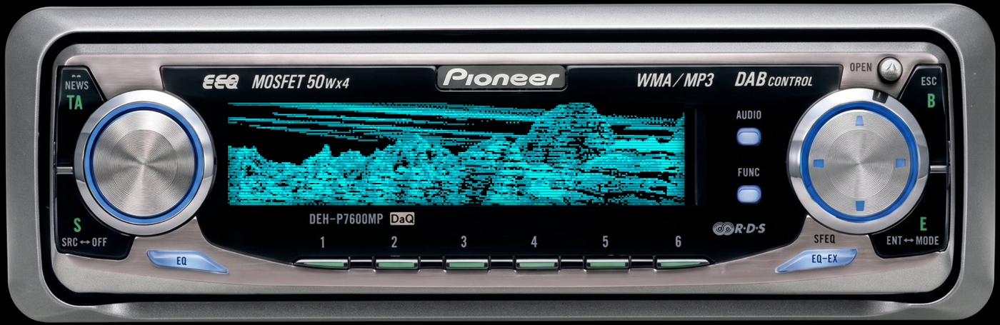
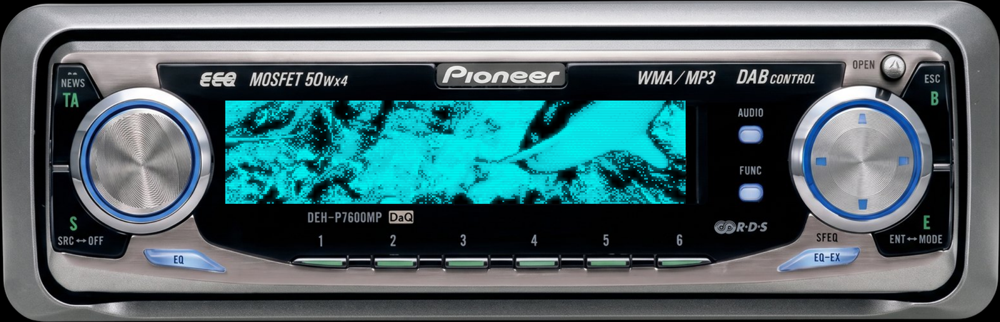

<p align="center">
  
</p>

<p align="center">
  <a href="https://github.com/youxufkhan/carozerra/releases/latest"></a>
  <a href="https://youxufkhan.github.io/carozerra/"></a>
  <a href="./LICENSE"></a>
</p>

<p align="center">
  <a href="./CHANGELOG.md">Changelog</a> •
  <a href="./ROADMAP.md">Roadmap</a>
</p>
<p align="center">
  <a href="https://youxufkhan.github.io/carozerra/">
    
  </a>
</p>

<p align="center"><sub>Live and playing right now at <a href="https://youxufkhan.github.io/carozerra/">youxufkhan.github.io/carozerra</a> — click the image, no install.</sub></p>

## What it is

Old Pioneer head units (e.g. the DEH-P7600MP) let you upload custom animations
to their blue OEL display via CD or PC link, stored as `.lkd` files no modern
software could open. Carozerra decodes them and brings the look back — on the
web or on a Linux desktop, with the stereo's own controls doing real things.

## How the format works

`.lkd` turned out to be a thin wrapper around **entirely standard formats** —
no proprietary codec, no guesswork left in the pipeline:

```
offset  bytes
0x00    "zLKD"   magic (7A 4C 4B 44)
0x04    uint32   version           = 3
0x08    uint32   (unknown)         = 1
0x0C    uint32   (unknown)         = 7
0x10    uint32   frame count       = 60
0x14    gzip stream ──▶ gunzip ──▶ TAR archive
                         └─ one member = a 24-bit Windows BMP
                            BMP = 256 × 3840, bottom-up, BGR
                                = 60 stacked frames of 256 × 64
```

Strip the 20-byte header → `gunzip` → `tar` → read the BMP → slice it into 60
frames of **256 × 64**. Native palette is cyan-blue `rgb(7,158,175)` + white on
black — the classic blue-OEL glow — and artwork is dithered (mountains,
waterfalls, leaping dolphins, etc.).

## Web player

Decodes fully client-side — `DecompressionStream` for gzip, an inline tar
reader, a BMP parser to canvas. 83 built-in clips (movies, backgrounds, stills,
level meters, and a full-color set — see `assets/clips/`) are preloaded and
picked from a categorized gallery of preview thumbnails that animate on hover;
drag-and-drop (or click) still lets you load any other `.lkd` file — nothing is
uploaded anywhere. GIF and WebM export (with the retro phosphor glow baked into
the output) are available via the Export buttons.

> Requires a browser with `DecompressionStream` (current Chrome/Firefox/Edge).

`←→` browse the gallery, and the footer's **Changelog** link opens
`CHANGELOG.md` in a modal — fetched at click time, so it never drifts from the
file in the repo.

To preview locally: `python3 -m http.server -d web 8000`, then open
`http://localhost:8000`. (`assets/pioneer.png`, `assets/clips/*.lkd` and
`CHANGELOG.md` need to be copied into `web/pioneer.png` / `web/clips/` /
`web/CHANGELOG.md` first — the CI workflow does this automatically at deploy
time; see `.github/workflows/pages.yml`.)

## Desktop app (Linux / Debian)

A frameless, transparent, stereo-shaped window: the faceplate floats on your
desktop and animations play on its OEL screen, with the stereo's own
controls wired to real actions.

<p align="center">
  
</p>

| Control | Action |
|---|---|
| **Presets 1–6** | switch animation (first six clips) |
| **Left knob** | drag to rotate / scroll wheel → **system volume** |
| **Right nav knob** | left/right = prev/next clip · up/down = animation speed |
| **FUNC** (by the display) | toggle retro glow |
| **ESC** (top-right) | quit |
| drag body / edges | move / resize the window (aspect-locked) |

Keyboard: `←→` clip, `↑↓` speed, `F` glow, `1–6`, `F1` control map, `Esc`.

The control map above is also shown on the faceplate for a few seconds at
launch, and `F1` brings it back. `Esc` closes it rather than quitting, so
dismissing the overlay can't take the app down with it.

**Install the `.deb`** (see [Releases](../../releases) for the latest build):

```bash
sudo apt install ./carozerra_<version>_all.deb
carozerra
```

**Or run from source** — dependencies are standard Debian/Ubuntu packages,
no pip install:

```bash
sudo apt install python3-pyqt6 python3-pil python3-numpy
python3 carozerra.py
```

System volume uses `wpctl` (PipeWire) with a `pactl` fallback. All 8
animations are preloaded from `assets/` — no drag-drop or upload in the
desktop app (that's a web-player-only feature).

### Windows (in progress — not released yet)

No Windows release exists yet; the `.deb` is still the only shipped build.
What exists today is a reproducible build plus an automated check:

```powershell
pip install PyQt6 pillow pyinstaller
python packaging/make-ico.py            # icon, generated from the faceplate art
pyinstaller --clean --noconfirm packaging/carozerra.spec
dist\carozerra.exe
```

Every push touching the app or its packaging builds that `.exe` on a
`windows-latest` runner and smoke-tests it via `packaging/smoke-windows.ps1`:
first `carozerra.exe --selftest out.png`, which renders one frame and exits
(so a build can be checked without a human at a screen), then a real
interactive launch that has to survive, own a top-level window, and be
screenshotted. Both PNGs and the exe are uploaded as artifacts of the
"Build .exe (check)" run — enough for a Linux-only maintainer to see what
Windows actually drew.

Known gaps before this can be a release:

- **The volume knob does nothing.** It drives `wpctl`/`pactl`, neither of
  which exists on Windows, so `get_volume()` returns a fixed 50 and the knob
  turns while lying. Needs either `pycaw` or an explicit disable.
- **The exe is unsigned**, so SmartScreen will warn, and antivirus false
  positives on PyInstaller output are common. (UPX compression is off in the
  spec for the same reason.)
- **It is large** — 46.7 MB, because a onefile PyQt6 bundle carries all of Qt.
- **Only a CI runner has run it**, and that runner is Windows Server 2025 at
  1024x768. The launch screenshot confirms DWM composites the frameless
  translucent window correctly and a clip plays, but edge-drag resize and
  HiDPI scaling still need eyes on a real Windows 10/11 desktop.

Geometry (screen rect, knob centers, button hitboxes) lives in the `G` dict
at the top of `carozerra.py` as fractions of the faceplate, so it scales with
the window and is easy to re-tune against a different photo.

## `decode.py` — batch converter

```bash
python decode.py                             # assets/clips/*.lkd -> out/<name>_clean.gif + _glow.gif
python decode.py assets/clips/movie6.lkd --mp4 --frames   # + MP4 + raw PNG frames
python decode.py --glow --scale 6 --fps 12    # glow only, 6x, 12fps
```

Options: `--outdir` (default `out/`), `--scale` (default 4 → 1024×256),
`--fps` (default 60 ms/frame), `--clean`, `--glow`, `--mp4`, `--frames`.
Importable too: `frames, meta = decode_lkd("assets/clips/movie1.lkd")` returns
60 RGB `PIL.Image` frames.

**clean** = faithful nearest-neighbor upscale. **glow** = OEL phosphor look
(bloom + scanlines on black). Needs Pillow (and `ffmpeg` on PATH for MP4).
Output goes to `out/` (gitignored — fully regenerable, not shipped).

## Releasing

Order matters: `pages.yml` triggers on pushes to `main`, not on tags, so the
website must go out before (or with) the tag — otherwise a new Release ships
alongside a site still serving the previous player.

```bash
git push origin main          # triggers packaging-check.yml + pages.yml
# wait for both green, and confirm the live site picked up the new build
git tag v1.2.0
git push origin v1.2.0        # triggers release.yml
```

Use the two-step push rather than `git push --tags`: that pushes only the tag,
leaving `main` (and the site) behind.

`release.yml` builds the `.deb` and attaches it to a new GitHub Release
automatically. To build locally without releasing:

```bash
packaging/build-deb.sh 1.2.0
# -> packaging/dist/carozerra_1.2.0_all.deb
```

## License

[MIT](./LICENSE) — covers the code (`decode.py`, `carozerra.py`, `web/`,
`packaging/`, `.github/`). The Pioneer product photography under
`assets/pioneer.png` and `reference/` is not original work of this project
and isn't covered by the license — it's included for reverse-engineering
documentation and UI purposes only.

<details>
<summary>Repo layout</summary>

```
carozerra/
├── web/                # GitHub Pages player — decodes .lkd fully client-side
│   ├── index.html
│   └── gifenc.esm.js     # vendored GIF encoder (mattdesl/gifenc, MIT) used by GIF export
├── carozerra.py         # Linux desktop visualizer (PyQt6)
├── decode.py             # .lkd decoder — CLI + importable library
├── assets/
│   ├── pioneer.png        # faceplate cutout, shared by web + desktop
│   ├── clips/               # the 83 preloaded .lkd animations (movies, bgv, bgp, level meters, color)
│   └── readme/                # this README's hero SVG + proof screenshots
├── reference/              # provenance only — not used by any code
│   ├── pioneer-original.jpeg
│   └── 1.gif
├── packaging/
│   ├── build-deb.sh         # -> packaging/dist/carozerra_<version>_all.deb
│   └── debian/                # control file template + .desktop entry
└── .github/workflows/
    ├── pages.yml               # deploys web/ whenever web/** or assets/** change
    ├── packaging-check.yml      # build-validates the .deb whenever app/packaging files change
    └── release.yml               # builds + attaches the .deb to a GitHub Release on every v* tag
```

</details>
